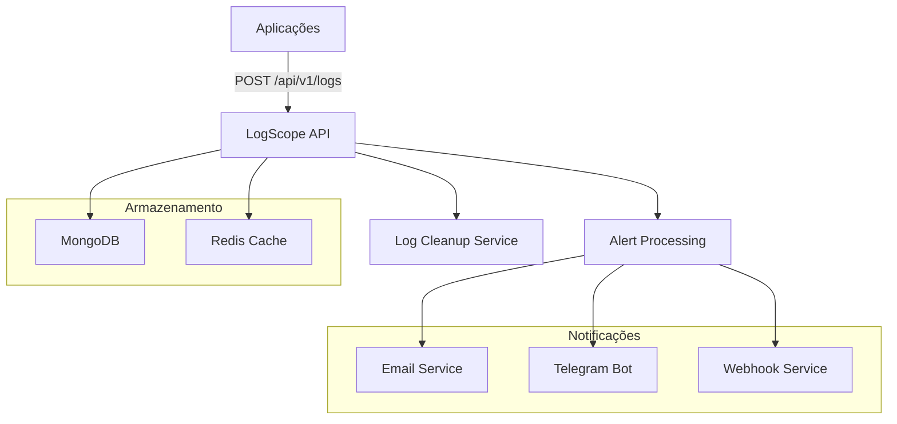

# LogScope API - Plataforma de Análise de Logs com Alertas Inteligentes

[](https://openjdk.java.net/)
[](https://spring.io/projects/spring-boot)
[](https://www.mongodb.com/)
[](https://redis.io/)
[](https://www.docker.com/)

## 🎯 Visão Geral

O LogScope API é uma plataforma robusta para ingestão, análise e monitoramento de logs de aplicações com sistema de alertas inteligentes em tempo real. Desenvolvido com Spring Boot e arquitetura moderna, oferece uma solução completa para centralização e análise de logs empresariais.

### ✨ Principais Funcionalidades

- **📝 Ingestão de Logs**: API REST para recebimento de logs estruturados
- **🔍 Análise em Tempo Real**: Processamento assíncrono com padrões configuráveis
- **🚨 Alertas Inteligentes**: Sistema de notificações por email, Telegram e webhooks
- **📊 Consultas Avançadas**: Filtros por aplicação, nível, período e conteúdo
- **🔐 Segurança Multi-Tenant**: JWT com suporte a múltiplos clientes
- **📈 Performance**: Redis para contadores e MongoDB para persistência
- **🐳 Containerização**: Docker Compose para deploy simplificado

## 🏗️ Arquitetura



## 🚀 Início Rápido

### Pré-requisitos

- Java 21+
- Docker & Docker Compose
- Maven 3.8+

### 1. Clone o Repositório

```bash
git clone https://github.com/gabrielpetry23/log-scope.git
cd log-scope
```

### 2. Configuração do Ambiente

Copie e configure as variáveis de ambiente:

```bash
cp .env.example .env
# Edite o arquivo .env com suas configurações
```

### 3. Deploy com Docker

```bash
# Iniciar todos os serviços
docker-compose up -d

# Verificar status
docker-compose ps

# Ver logs
docker-compose logs -f api
```

### 4. Primeira Configuração

```bash
# Criar administrador global
curl -X POST http://localhost:8080/oauth/register-client \
  -H "Content-Type: application/json" \
  -d '{
    "companyName": "Minha Empresa",
    "contactEmail": "admin@empresa.com",
    "initialAdminPassword": "senha123"
  }'
```

## 📡 Endpoints da API

### 🔐 Autenticação

#### Login de Usuário
```http
POST /oauth/login
Content-Type: application/json

{
  "username": "admin@empresa.com",
  "password": "senha123"
}
```

#### Token para Sistema (Client Credentials)
```http
POST /oauth/token
Content-Type: application/x-www-form-urlencoded

grant_type=client_credentials&client_id=CLIENT_ID&client_secret=CLIENT_SECRET
```

### 📝 Logs

#### Enviar Log
```http
POST /api/v1/logs
Authorization: Bearer TOKEN
Content-Type: application/json

{
  "timestamp": "2025-01-25T15:30:00",
  "level": "ERROR",
  "application": "user-service",
  "environment": "prod",
  "message": "NullPointerException at UserController.java:42",
  "hostname": "server-01",
  "metadata": {
    "thread": "http-nio-8080-exec-1",
    "userId": "12345",
    "ip": "192.168.1.100"
  }
}
```

#### Consultar Logs
```http
GET /api/v1/logs?level=ERROR&start=2025-01-25T00:00:00&end=2025-01-25T23:59:59&messageContains=Exception
Authorization: Bearer TOKEN
```

### 🚨 Regras de Alerta

#### Criar Regra
```http
POST /api/v1/rules
Authorization: Bearer TOKEN
Content-Type: application/json

{
  "name": "Erro Crítico NPE",
  "application": "user-service",
  "environment": "prod",
  "level": "ERROR",
  "matchPattern": "NullPointerException",
  "threshold": 5,
  "intervalSeconds": 300,
  "notificationChannels": ["email", "telegram"],
  "enabled": true
}
```

#### Listar Regras
```http
GET /api/v1/rules
Authorization: Bearer TOKEN
```

### 📊 Alertas

#### Histórico de Alertas
```http
GET /api/v1/alerts/history?start=2025-01-25T00:00:00&end=2025-01-25T23:59:59
Authorization: Bearer TOKEN
```

#### Testar Regra
```http
POST /api/v1/alerts/test
Authorization: Bearer TOKEN
Content-Type: application/json

{
  "application": "user-service",
  "logSample": "java.lang.NullPointerException: Cannot invoke method"
}
```

## 🔧 Configuração

### Variáveis de Ambiente

| Variável | Descrição | Padrão |
|----------|-----------|--------|
| `SPRING_DATA_MONGODB_URI` | URI do MongoDB | `mongodb://localhost:27017/logscope` |
| `REDIS_HOST` | Host do Redis | `localhost` |
| `REDIS_PASSWORD` | Senha do Redis | ` ` |
| `JWT_SECRET` | Chave secreta JWT | `required` |
| `LOG_RETENTION_DAYS` | Dias de retenção dos logs | `30` |
| `ALERT_EMAIL_ENABLED` | Habilitar alertas por email | `true` |
| `MAIL_HOST` | Servidor SMTP | `smtp.gmail.com` |
| `MAIL_USERNAME` | Usuário SMTP | ` ` |
| `MAIL_PASSWORD` | Senha SMTP | ` ` |

### Configuração de Email

Para alertas por email, configure seu provedor SMTP:

```yaml
# Gmail
MAIL_HOST=smtp.gmail.com
MAIL_PORT=587
MAIL_USERNAME=seu-email@gmail.com
MAIL_PASSWORD=sua-senha-app

# Outlook
MAIL_HOST=smtp-mail.outlook.com
MAIL_PORT=587
MAIL_USERNAME=seu-email@outlook.com
MAIL_PASSWORD=sua-senha
```

### Configuração do Telegram

1. Crie um bot no BotFather
2. Obtenha o token do bot
3. Configure as variáveis:

```bash
ALERT_TELEGRAM_ENABLED=true
TELEGRAM_BOT_TOKEN=seu-bot-token
TELEGRAM_CHAT_ID=seu-chat-id
```

## 🛠️ Desenvolvimento

### Executar Localmente

```bash
# Iniciar dependências
docker-compose up -d mongodb redis rabbitmq

# Configurar perfil de desenvolvimento
export SPRING_PROFILES_ACTIVE=dev

# Executar aplicação
cd logscopeapi
./mvnw spring-boot:run
```

### Testes

```bash
# Executar todos os testes
./mvnw test

# Testes de integração
./mvnw test -Dtest=**/*IntegrationTest

# Coverage report
./mvnw jacoco:report
```

### Build para Produção

```bash
# Gerar JAR
./mvnw clean package -DskipTests

# Build da imagem Docker
docker build -t logscope-api:latest .
```

## 📊 Monitoramento

### Health Checks

```bash
# Status da aplicação
curl http://localhost:8080/actuator/health

# Métricas
curl http://localhost:8080/actuator/metrics

# Prometheus metrics
curl http://localhost:8080/actuator/prometheus
```

### Logs da Aplicação

```bash
# Logs em tempo real
docker-compose logs -f api

# Logs específicos
docker-compose logs api | grep ERROR
```

## 🔒 Segurança

### Roles e Permissões

| Role | Descrição | Permissões |
|------|-----------|------------|
| `GLOBAL_ADMIN` | Administrador global | Todas as operações |
| `COMPANY_ADMIN` | Administrador da empresa | Gerenciar usuários e regras |
| `COMPANY_SYSTEM` | Sistema da empresa | Enviar logs |
| `COMPANY_VIEWER` | Visualizador | Consultar logs e alertas |
| `GLOBAL_SUPPORT` | Suporte global | Visualizar tudo, não modificar |

### JWT Token

Os tokens JWT incluem:
- Username/Client ID
- Roles do usuário
- Client ID (para multi-tenancy)
- Expiração configurável

## 🚀 Deploy em Produção

### Docker Swarm

```bash
# Inicializar swarm
docker swarm init

# Deploy do stack
docker stack deploy -c docker-compose.prod.yml logscope
```

### Kubernetes

```bash
# Aplicar manifests
kubectl apply -f k8s/

# Verificar pods
kubectl get pods -n logscope
```

### Configurações de Produção

1. **Banco de Dados**: Use MongoDB replica set
2. **Cache**: Configure Redis Cluster
3. **Logs**: Configure log aggregation (ELK Stack)
4. **Monitoring**: Configure Prometheus + Grafana
5. **Backup**: Configure backup automático dos dados

## 📈 Performance

### Métricas Importantes

- **Throughput**: 10.000+ logs/segundo
- **Latência**: < 100ms para ingestão
- **Memória**: < 1GB RAM (configuração padrão)
- **Storage**: MongoDB com índices otimizados

### Otimizações

1. **Índices MongoDB**: Criados automaticamente nos campos principais
2. **Cache Redis**: TTL automático para contadores
3. **Processamento Assíncrono**: Alertas processados em background
4. **Cleanup Automático**: Logs antigos removidos automaticamente

## 🤝 Contribuição

1. Fork o projeto
2. Crie uma branch para sua feature (`git checkout -b feature/AmazingFeature`)
3. Commit suas mudanças (`git commit -m 'Add some AmazingFeature'`)
4. Push para a branch (`git push origin feature/AmazingFeature`)
5. Abra um Pull Request

## 📝 Licença

Este projeto está licenciado sob a MIT License - veja o arquivo [LICENSE](LICENSE) para detalhes.

## 📞 Suporte

- **Documentação**: [Wiki do Projeto](https://github.com/gabrielpetry23/log-scope/wiki)
- **Issues**: [GitHub Issues](https://github.com/gabrielpetry23/log-scope/issues)
- **Email**: support@logscope.com

---

**LogScope API** - Desenvolvido com ❤️ usando Spring Boot e tecnologias modernas.
